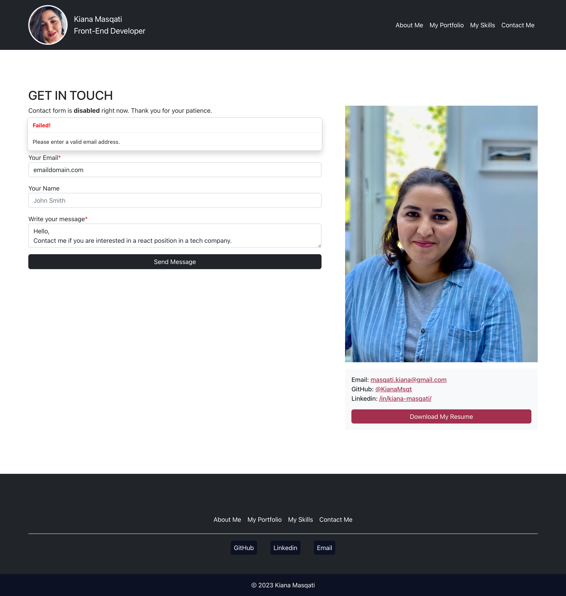

# React Portfolio

## Description
---
This application was created for showing an online portfolio website using react.js, bootstrap and react-router designed and developed by [@KianaMsqt](https://github.com/KianaMsqt)

## Available Scripts
---
In the project directory, you can run:

### `npm i`
or
### `npm install`

It will install all project's dependencies on your local if needed.

To render the app, you can run:
### `npm start`

Runs the app in the development mode.\
Open [http://localhost:3000](http://localhost:3000) to view it in your browser.

The page will reload when you make changes.\
You may also see any lint errors in the console.

### `npm run build`

Builds the app for production to the `build` folder.\
It correctly bundles React in production mode and optimizes the build for the best performance.

The build is minified and the filenames include the hashes.\
Your app is ready to be deployed!

See the section about [deployment](https://facebook.github.io/create-react-app/docs/deployment) for more information.

### `npm run deploy`

Runs build and deploy on GitHub Pages. If you like to fork this project and deploy the app on your GitHub pages you will need to change `"homepage"` in `package.json`.

## Demo
Deployed application is available in following link:
https://kianamsqt.github.io/react-portfolio/

Following images show the web application's appearance:

|  |
|:--:|
| <b>Home Page</b>|

|  |
|:--:|
| <b>Portfolio</b>|

|  |
|:--:|
| <b>Project Details</b>|

|  |
|:--:|
| <b>Skills</b>|

|  |
|:--:|
| <b>Contact page with an error message on form validation</b>|

|  |
|:--:|
| <b>Contact page with a success message on form validation</b>|

## Contributing
You can reach the project on https://github.com/KianaMsqt/react-portfolio .